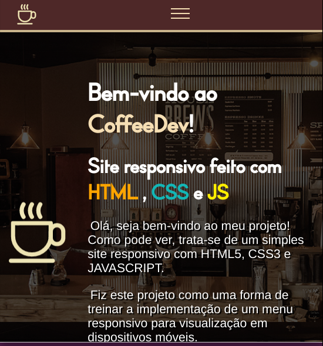

<h1 align="center"> Navbar Responsiva com CSS e JavaScript </h1>

<h2 align="center">Estudo sobre responsividade e menu hamburguer</h2>

<h2> ➢ Um simples estudo </h2>

 
  Esta página foi feita com o objetivo de estudar e treinar a aplicação
  de um menu responsivo usando CSS e JavaScript DOM.

 
  O tema da página é simplesmente um Café para Devs... Foi a melhor ideia que
  eu tive nesse dia :')

  Você pode acessar o site clicando neste link: https://quimicafacil.vercel.app

<h3> ➢ Outras informações </h3>
<ul>
  <li> <strong>Status:</strong> <em>Finalizado</em>
  <li> <strong>Linguagens utilizadas:</strong>  
    

      
      
      
    

  <li> <strong>Conhecimentos aplicados:</strong>
  <ul>
    <li> <em>CSS Flexbox</em>
    <li> <em>Animações com CSS </em>
    <li> <em>CSS Custom Properties</em>
    <li> <em>Media Queries</em>
    <li> <em>JavaScript DOM</em>
  </ul>
</ul>
